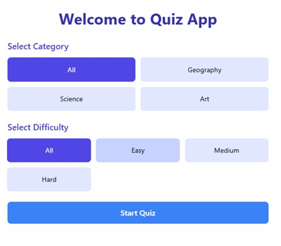
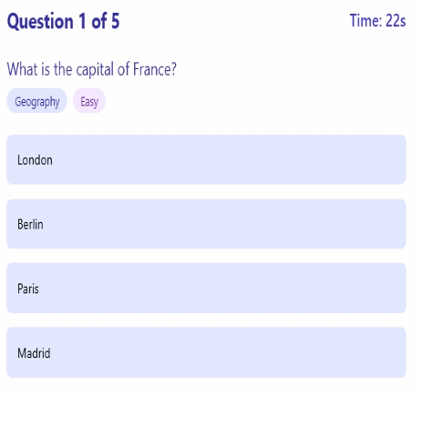

# 🎉 **Quiz App with React, Redux & PHP Backend**

---

<p align="center">
  
  
  
</p>

---

## 🚀 **Features**

- 🖼️ Multiple choice questions with images
- 🗂️ Category filtering
- 🏆 Score tracking
- 📜 Quiz history
- 📱 Responsive design

---

## 🖼️ **Screenshots**

<p align="center">
  
  <br/>
  <em>Home Screen: Select Category & Difficulty</em>
</p>

<p align="center">
  
  <br/>
  <em>Quiz Screen: Answering a Question</em>
</p>

---

## 🛠️ **Prerequisites**

- [Node.js & npm](https://nodejs.org/)
- [PHP 7.4+](https://www.php.net/)
- [XAMPP, WAMP, or MAMP](https://www.apachefriends.org/) (for PHP server)

---

## ⚡ **Quick Start**

### 1️⃣ Frontend (React + Redux)

```bash
cd frontend
npm install
npm start
```

### 2️⃣ Backend (PHP)

#### Option 1: XAMPP/WAMP/MAMP

1. Copy the `php-backend` folder to your web server's root directory:
   - **XAMPP:** `C:\xampp\htdocs\`
   - **WAMP:** `C:\wamp\www\`
   - **MAMP:** `C:\MAMP\htdocs\`
2. Start Apache from your control panel.

#### Option 2: PHP Built-in Server

```bash
cd php-backend
php -S localhost:80
```

---

## 🌐 **Usage**

1. Open your browser and go to: `http://localhost:3001` (or the port shown in your terminal)
2. Select a category or use "All Categories"
3. Answer the questions
4. View your score and history

---

## 📁 **Project Structure**

```text
frontend/     # React frontend with Redux
php-backend/  # PHP backend API
backend/      # (Legacy/simple PHP backend)
```

---

## 👤 **Owner**

<p align="center">
  <b>MAHAVEER SINGH</b> <br/>
  
</p>

---

## 📝 **License**

© MAHAVEER SINGH MSP 2025 